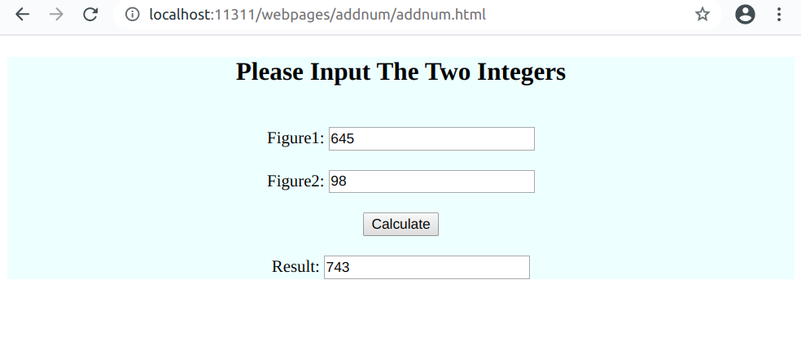

# minimal-http-server

This is an oversimplified http server implemented based on CSAPP (Network Programming)

## Usage:
```sh
make    # build binaries
./bin/server ${HOST} ${PORT}    # run server from current directory
```
This will create a socket for the server and bind it to `${HOST}:${PORT}` (default `localhost:11311`). You can place your files and folders under the project and access them through http reponses.

The server only supports http `GET` and `POST` methods. Examples are as follows

* `GET` example

  Taking address `localhost:11311` as an example. Type in the address bar `http://localhost:11311/cgi-bin/addnum?figure1=645&figure2=98` you will get the final result as text (743).

* `POST` example

  Type in the address bar `http://localhost:11311/webpages/addnum/addnum.html`, and input one integer in each of the first two input bars. If you click on the `Calculate` button the browser will issue a `POST` request. The sum of the two integers will be displayed in the last blank.

  